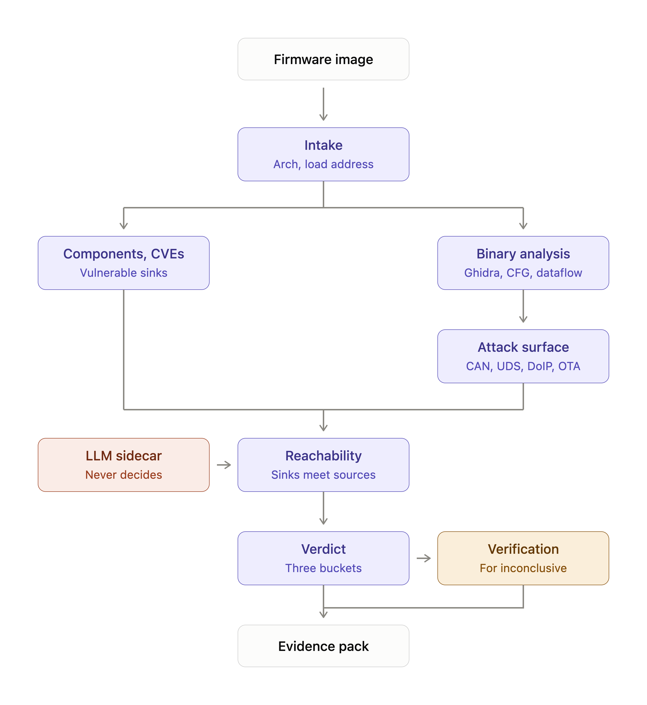

# Automotive Firmware Reachability Engine

**A tool that tells automotive security teams which vulnerabilities in their ECU
firmware are actually reachable, not just present.**

A firmware image may carry a hundred known CVEs in vendored components. A scanner
lists all hundred. That answers *presence*, and it is nearly useless to the team
deciding what to fix before the next release.

The question that allocates engineering time is whether an attacker can actually
drive the defect from somewhere they can touch — CAN, UDS, DoIP, OTA. Answering
it requires a **path** through the binary, from a source an attacker influences
to the sink where the vulnerability lives.

Presence is a lookup. Reachability is an analysis, and it either has a path or it
does not.

## Architecture



**[docs/architecture/](docs/architecture/) is the source of truth for system
design** — the diagram, and one contract per component covering its position,
responsibility, inputs, outputs, permitted dependencies, and how it is tested.

```text
firmware image → intake → ┬→ components/CVEs  → vulnerable sinks ─┐
                          └→ binary analysis  → attack surface  ──┤
                                                                  ▼
                          LLM sidecar ─────────────→  reachability engine
                          (never decides)                         │
                                                                  ▼
                                          verdict ──→ verification (optional)
                                                                  │
                                                            evidence pack
```

## The principle

> **The model can suggest. The analysis engine decides. The evidence proves.**

The reachability decision is deterministic. Same firmware, same verdict, every
time. A language model assists with interpretation, labelling and explanation,
and is architecturally prevented from deciding anything: remove every model
annotation and the verdicts must not change.

## Three verdicts

| Verdict | Means | Requires |
|---|---|---|
| `REACHABLE` | A path exists from an automotive source to the vulnerable sink | The concrete path, with per-hop evidence |
| `NOT_REACHABLE` | No path exists | A justification for the *absence* of one |
| `INCONCLUSIVE` | The analysis could not decide | A specific statement of what blocked it |

There is no fourth bucket, and **no confidence percentage on a verdict.** The
evidence chain is what supports it; a number beside it would invite readers to
average across findings whose missing pieces are not comparable.

**The engine prefers `INCONCLUSIVE` to an unjustified `NOT_REACHABLE`.** The
three errors do not cost the same. A wrong `REACHABLE` wastes time and gets
discovered. A wrong `NOT_REACHABLE` tells a security team a live defect is safe
to deprioritise, and nothing downstream is looking for it. A confirmed
false-unreachable is a **release blocker**.

## The deliverable

An **Evidence Pack**: the CVE, the vulnerable sink, the automotive entry point,
the source-to-sink path, the CFG and data-flow evidence, the binary evidence,
verification evidence if it was performed, the unresolved assumptions, and the
verdict.

A verdict without its evidence is a claim. A security team acting on "not
reachable" needs to see why.

## Status

The architecture describes the target system. This is what exists today.

| Component | Status |
|---|---|
| Intake | **Built** — fingerprints, entropy, fill-byte and repeated-block analysis, explicit processor selection |
| Binary analysis | **Built for CFG-level facts** — Ghidra via PyGhidra behind an engine-independent interface: functions, call graph, xrefs, decompilation. Data-flow analysis is not built |
| LLM sidecar | **Built** — bounded investigator whose claims are checked against gathered facts, with content-addressed provenance for every model call |
| Evidence pack | **Foundations built** — evidence schema and reporting with `known` / `inferred` / `unknown` distinctions |
| Components/CVEs, attack surface, reachability engine, verdict, verification | **Not built** |

### First technical goal

> Given one supported ECU firmware image, a known vulnerable function, and an
> identified automotive entry point, determine deterministically whether a valid
> path exists from the source to the vulnerable sink, and output the evidence
> supporting that verdict.

Narrow on purpose. Not the whole system.

## What this is not

This system reads firmware and reports reachability with evidence. It does not
generate or execute exploits, flash or control vehicles, certify regulatory
compliance, reconstruct source code, or decompile an ECU with a language model.

Only analyse firmware you are authorised to possess and inspect.

## Secondary use case: legacy ECU recovery

The same machinery answers a different question that engineers pay for today:
*what does this undocumented function actually do?*

Call graphs, cross-references, decompilation, hidden ground truth and an
evidence-first report are what a reverse engineer needs when a controller
outlives its source, symbols, toolchain and original team. That capability is
built and kept — see [PROJECT.md](PROJECT.md#secondary-use-case-legacy-ecu-recovery).

It is a use case, not the product identity.

## Quick start

Python 3.11 or newer. The checked-in `.python-version` selects 3.11.

```bash
uv sync --extra dev
uv run ecu-recovery doctor
uv run ecu-recovery analyze path/to/firmware.bin \
  --processor ST10F269 \
  --database artifacts/investigations.sqlite3 \
  --report artifacts/report.md
uv run pytest
```

### Static analysis with Ghidra

```bash
brew install ghidra            # or set GHIDRA_INSTALL_DIR
uv sync --extra ghidra
uv run ecu-recovery analyze \
  samples/synthetic/binaries/multi_function_pipeline_v1/firmware.stripped \
  --ghidra --decompile \
  --analysis-json artifacts/analysis.json
```

That discovers functions, the call graph, strings, and memory regions, and writes
the full serialized result to `artifacts/analysis.json`. For a raw dump with no
load address, add `--language` and `--base-address`.

Ghidra tests run by default and skip with a stated reason when it is missing.
Skip the slow JVM path with `uv run pytest -m "not ghidra"`.

See [docs/ghidra-integration.md](docs/ghidra-integration.md) for the layering,
discovery order, response bounds, and what has actually been measured.

`uv.lock` pins the complete development environment:

```bash
uv run ruff check .
uv run ruff format --check .
uv run mypy
```

Rebuild and verify the synthetic laboratory:

```bash
uv run python scripts/build_synthetic.py
uv run pytest tests/test_synthetic_lab.py
```

See [docs/synthetic-lab.md](docs/synthetic-lab.md) for the visibility boundary,
architecture rationale, metadata contract, and exact evaluation formulas.

## Project map

The package is named `ecu_recovery` and the repository `Legacy-ECU-recovery`.
Both names predate this architecture and are kept for now — renaming touches
every import across work that is already verified. They are historical, not a
statement of scope.

```text
docs/architecture/        the architecture of record: diagram + component contracts
src/ecu_recovery/         core library and CLI
  binary/                 firmware intake boundary        → Intake
  analysis/               deterministic analysis boundary → Binary analysis
    models.py             engine-free analysis vocabulary
    base.py               engine interface, bounds, typed errors
    ghidra.py             the only module that touches Java
  agent/                  bounded investigator            → LLM sidecar
  providers/openai/       model transport, one attempt, no key on disk
  evidence/               evidence model boundary         → Evidence pack
  reports/                reporting boundary              → Evidence pack
  evaluation/             scoring and gates (development infrastructure)
samples/synthetic/        known-source firmware laboratory
scripts/                  reproducible dataset builder
tests/                    automated tests
```

New components are expected to live under a path that names the box they
implement, so the diagram and the source tree can be read side by side.

## How this project is built

Development follows the dependency graph in
[docs/MASTER_SPEC.md](docs/MASTER_SPEC.md), the authoritative engineering
specification. Work is executed one bounded node at a time, and an edge means the
prerequisite was *verified* — not that an agent reported done.

**Architecture changes are documented before or alongside implementation.** A
system design that arrives through an implementation diff is a design nobody
reviewed. If implementation exposes a real architectural problem, the change is
proposed — problem, tradeoffs, affected contracts, migration consequence — before
it is built.

Benchmarking is CI and development infrastructure. It does not appear in the
runtime architecture. Metrics and the false-unreachable release blocker are in
[EVALS.md](EVALS.md).

The current frontier and node status live in [TODO.md](TODO.md). What actually
exists is in [ARCHITECTURE.md](ARCHITECTURE.md).
